# Vehicle Detection Project - Writeup

## Project goals

The goals / steps of this project are the following:

* Perform a Histogram of Oriented Gradients (HOG) feature extraction on a labeled training set of images and train a classifier Linear SVM classifier
* Optionally, you can also apply a color transform and append binned color features, as well as histograms of color, to your HOG feature vector. 
* Note: for those first two steps don't forget to normalize your features and randomize a selection for training and testing.
* Implement a sliding-window technique and use your trained classifier to search for vehicles in images.
* Run your pipeline on a video stream (start with the test_video.mp4 and later implement on full project_video.mp4) and create a heat map of recurring detections frame by frame to reject outliers and follow detected vehicles.
* Estimate a bounding box for vehicles detected.

## Rubric Points

### Here I will consider the [rubric points](https://review.udacity.com/#!/rubrics/513/view) individually and describe how I addressed each point in my implementation. All implementation is in the [vehicle_detection.ipynb](vehicle_detection.ipynb) notebook.

---
### Writeup / README

#### 1. Provide a Writeup / README that includes all the rubric points and how you addressed each one.  You can submit your writeup as markdown or pdf.  [Here](https://github.com/udacity/CarND-Vehicle-Detection/blob/master/writeup_template.md) is a template writeup for this project you can use as a guide and a starting point.  

You're reading it!

---
### Histogram of Oriented Gradients (HOG)

#### 1. Explain how (and identify where in your code) you extracted HOG features from the training images.

The code for this step is in the **HOG and Color features** section of the [notebook](vehicle_detection.ipynb).

Basically, I took the examples and parameters shown in the class:

* `convert_color()` implements conversion to YCrCb color space.
* `get_hog_features()` implements HOG features extraction (for single channel), using parameters `orientations=9`, `pixels_per_cell=8` and `cells_per_block=2`
* `get_hog_features_all()` combines HOG features from the 3 channels (Y, Cr and Cb)
* `bin_spatial()` extracts binned color features, using `spatial_size=32` from the 3 channels.
* `color_hist()` extracts color histograms, with `32` bins for each channel.

All the features are concatenated into one big feature vector (`get_image_features()`), which produces a total of `8460` features. 
 
Here is an example showing a training image (first row left), its representation in YCrCb (second row), HOG features in each channel (third row), color histogram (first row middle) and downsized Y channel used in binned color features (first row right):

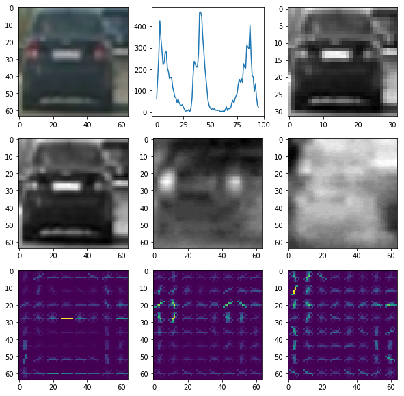

I iterate over all vehicle and non-vehicle images in the **Load data** section of the notebook, producing feature vector for each.

#### 2. Explain how you settled on your final choice of HOG parameters.

I think all the feature extraction parameters should be treated as model parameters, and we could do a grid or random search with cross-validation to find optimal settings. Practically, this would take quite a long time, because the feature vectors have to be re-loaded every time.

I started off with the combined feature vector implied in the class (described above), using the same parameters from the class, trained the model with it, and it performed really well (99.3% accuracy on test set)! I just carried on with the model and it was totally enough to classify the video, so I never went back and did a search for more optimal parameters.

#### 3. Describe how (and identify where in your code) you trained a classifier using your selected HOG features (and color features if you used them).

The final data set preparation is in the **Loading data** section, where I do a randomized split into training (80%) and test (20%) data sets, and define `X_scaler` which normalizes the training data. I end up with `14208` training samples and `3552` test samples, with about even split between vehicle and non-vehicle examples. As mentioned above, feature vectors are `8460` in size.

The actual training then is really straightforward, and done in the **Train SVC** section of the notebook. I fit a `LinearSVC` with default parameters,which gives `99.3%` accuracy on the test set, which is great!

In fact, I tried some other models too (not in the notebook), here are some findings:

* Changing `C` parameter didn't really change `LinearSVC` accuracy, so I stayed with the default
* `SVC` with RBF kernel performed marginally better, but it was really slow - not just to train but to classify too - so it wasn't a feasible option.
* Decision trees performed quite poorly, at least with the default parameters
* `LogisticRegression` gave similar accuracy as `LinearSVC` (which makes sense - both are linear models), and was actually faster in classifying. Personally, logistic regression would be my choice, but I stuck with SVM for this project.

---
### Sliding Window Search

#### 1. Describe how (and identify where in your code) you implemented a sliding window search.  How did you decide what scales to search and how much to overlap windows?

This is implemented in **Window Search** section of the notebook, which is essentially the code from the class. Since it performed quite well, I didn't change the parameters. It searches `y` range `(400, 656)` with the scale `1.5` which is `(96, 96)` window size.

I would defintely have used couple of different scales (and the code is ready for it), but the cars in `project_video.mp4` didn't vary much in size, so one scale was enough.

#### 2. Show some examples of test images to demonstrate how your pipeline is working.  What did you do to optimize the performance of your classifier?

I searched on just one scale using YCrCb 3-channel HOG features plus spatially binned color and histograms of color in the feature vector (as was shown in the example), which provided a nice result.

To deal with the overlaps I created a heatmap and then used `scipy.ndimage.measurements.label()` to identify individual blobs in the heatmap.  I then assumed each blob corresponded to a vehicle.  I constructed bounding boxes to cover the area of each blob detected.  

I actually didn't use the threshold of `2` in the heatmap, because in some of the frames the white car was only detected in one sliding window, and I didn't want to miss that. Instead I dealt with the false positives using the consecutive video frames - as described below.

Here are some examples of original boxes, heatmaps and joined boxes:

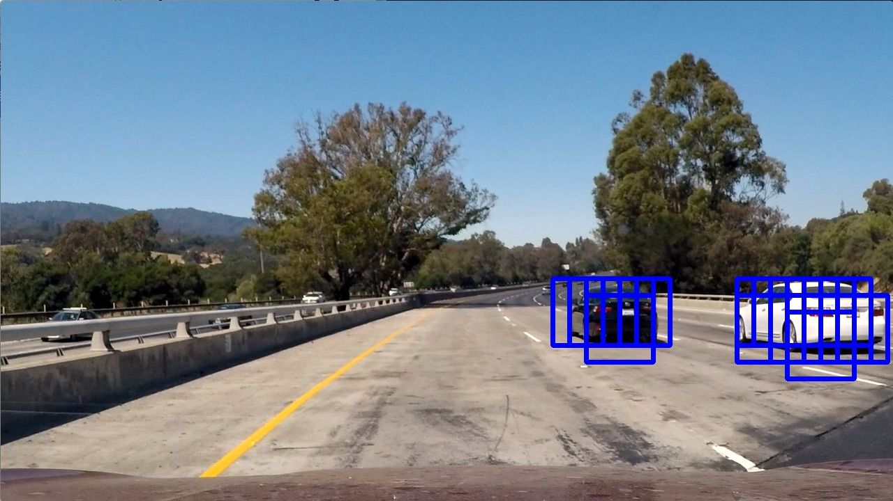  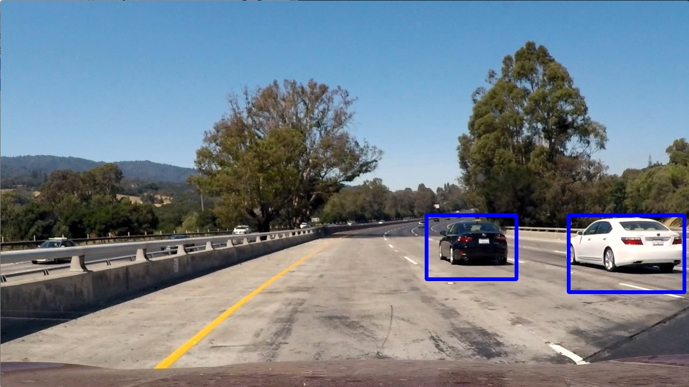

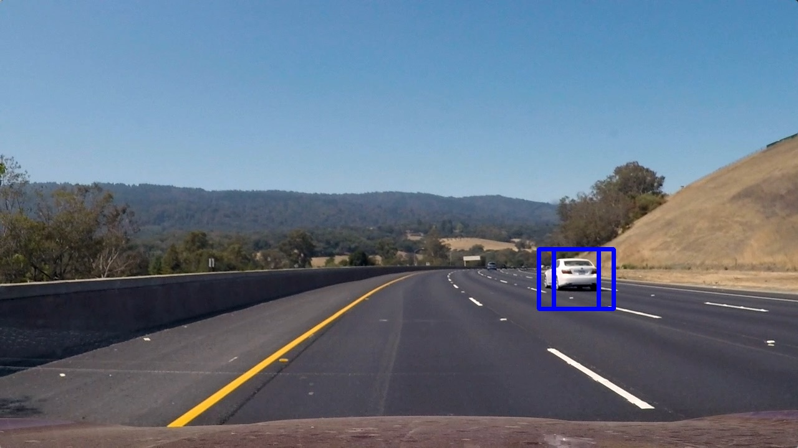  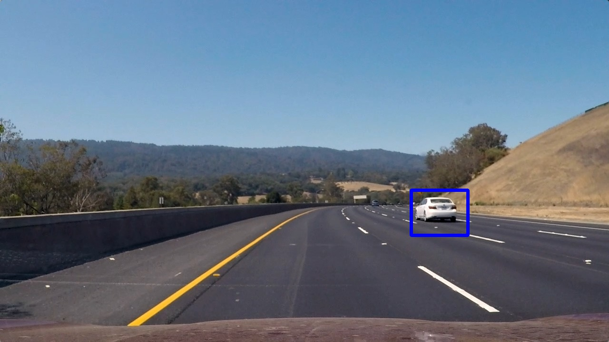

and here are a couple with false positives:

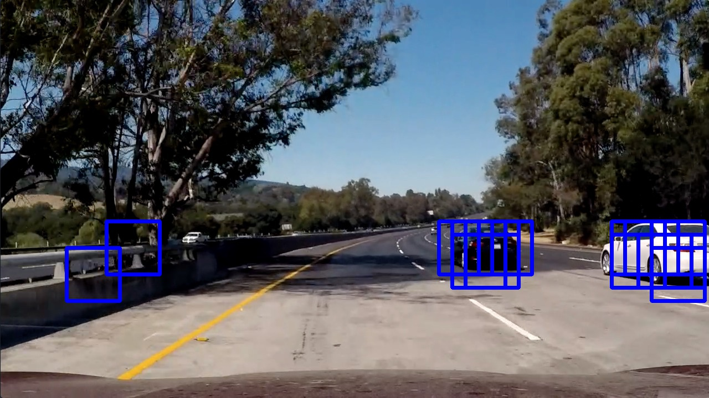 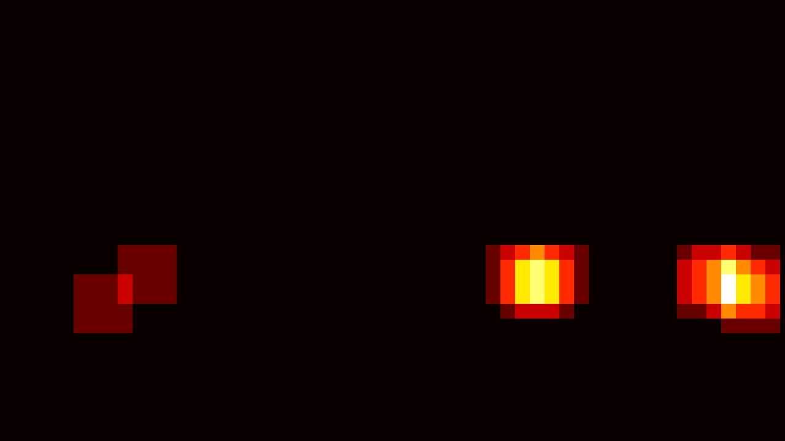 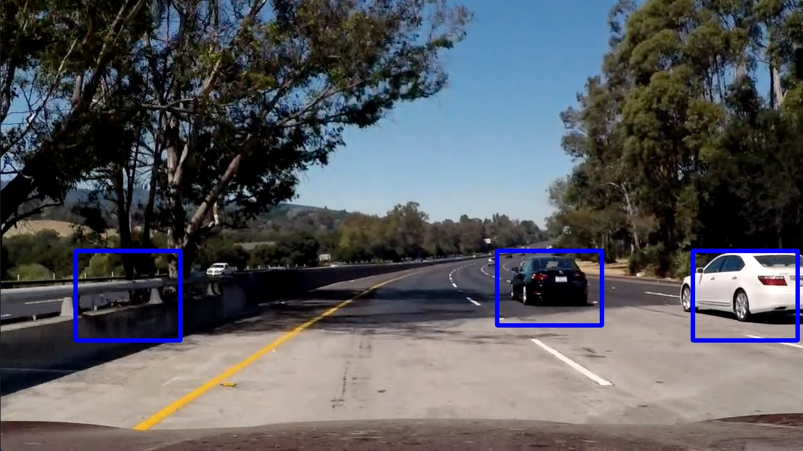

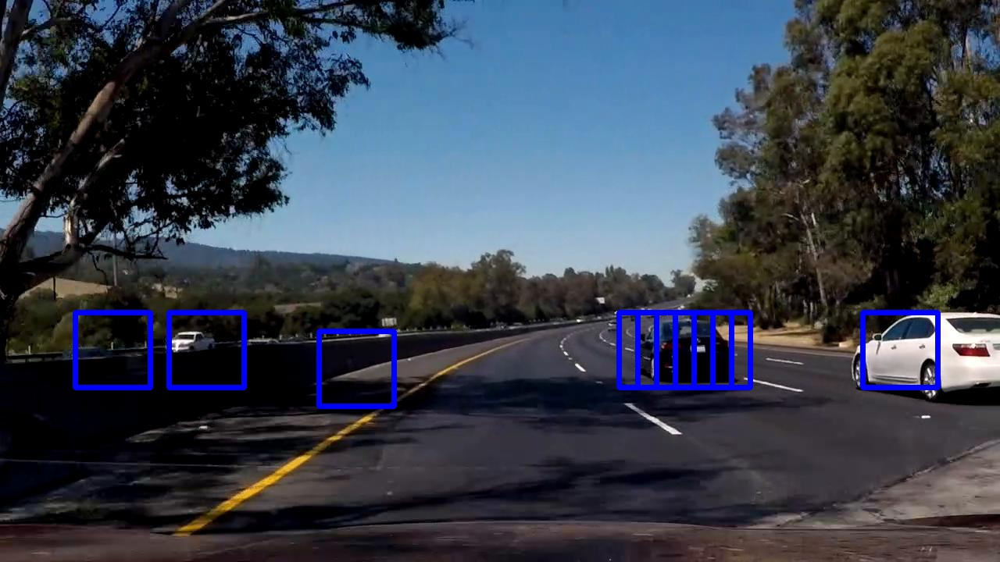 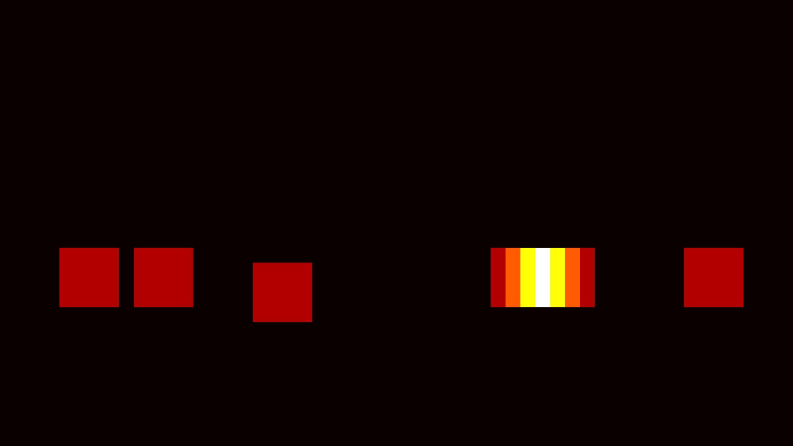 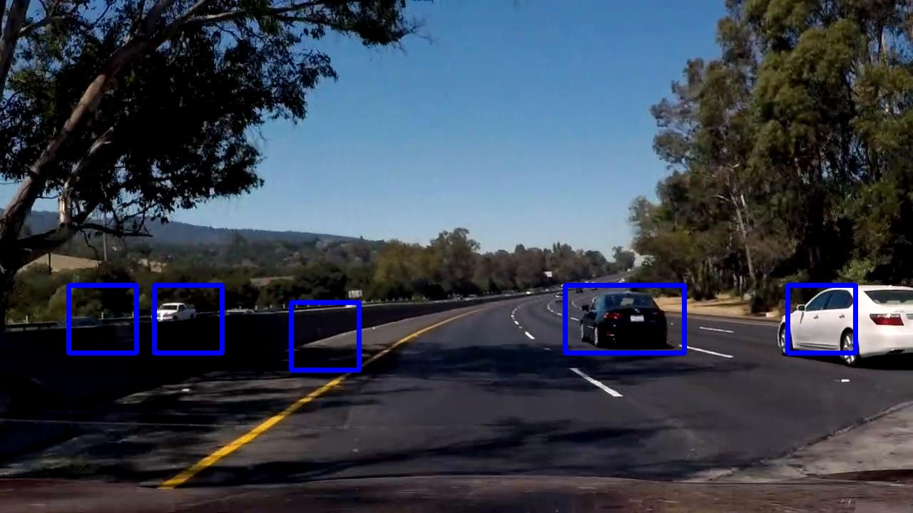

---
### Video Implementation

#### 1. Provide a link to your final video output.  Your pipeline should perform reasonably well on the entire project video (somewhat wobbly or unstable bounding boxes are ok as long as you are identifying the vehicles most of the time with minimal false positives.)

Here a [link to my video result](./output_videos/project_video.mp4) and a YouTube version:

#### 2. Describe how (and identify where in your code) you implemented some kind of filter for false positives and some method for combining overlapping bounding boxes.

The video processing is implemented in **Video** section in the notebook, which defines the function `process()`.

I used a kind of "heatmap in time" to deal with false positives:

* I kept a global cumulative heatmap `heat_cum`, initialized with zeros
* At every frame where a potential vehicle blob is detected, `heat_cum` is increased by `1`.
* At every frame where NO potential vehicle blob is detected, `heat_cum` is decreased by `10`.
* Vehicles are reported only when `heat_cum` is above `10`

This results in a time-integration, where a detection has to appear in at least 10 consecutive frames to be detected, and it filters out (almost) all false positives!

---

### Discussion

#### 1. Briefly discuss any problems / issues you faced in your implementation of this project.  Where will your pipeline likely fail?  What could you do to make it more robust?

In general I didn't face many challenges in this project, but mainly because there were lot of great examples from the class for all the parts.

One obvious drawback of my time-integration approach is that the pipeline will not detect cars that are moving fast relatively to us, and don't stay in the same place in the image for 10 frames. But to deal with that, one simply needs to have better classifier and less false-positives.

Regarding the classifier, I have some doubts about it. Even tough the accuracy on the test set was good (99.3%), when you look at the  false positives in the last example, it sees a lot of cars in the shadows :) One possible problem is that the training dataset is not a good representative of our video test data, so perhaps it hasn't seen enough shadows which are not cars. Or maybe we need to push the accuracy even further to 99.9%, but then we need a bigger dataset.

 Another likely problem is that the linear classifiers aren't that great for image recognition, and it would be nice to try a  neural-network based approach (which I suspect we will in further courses).
